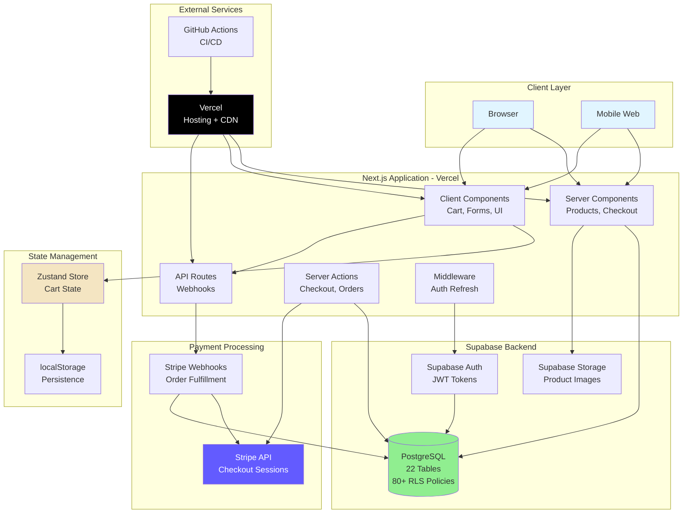
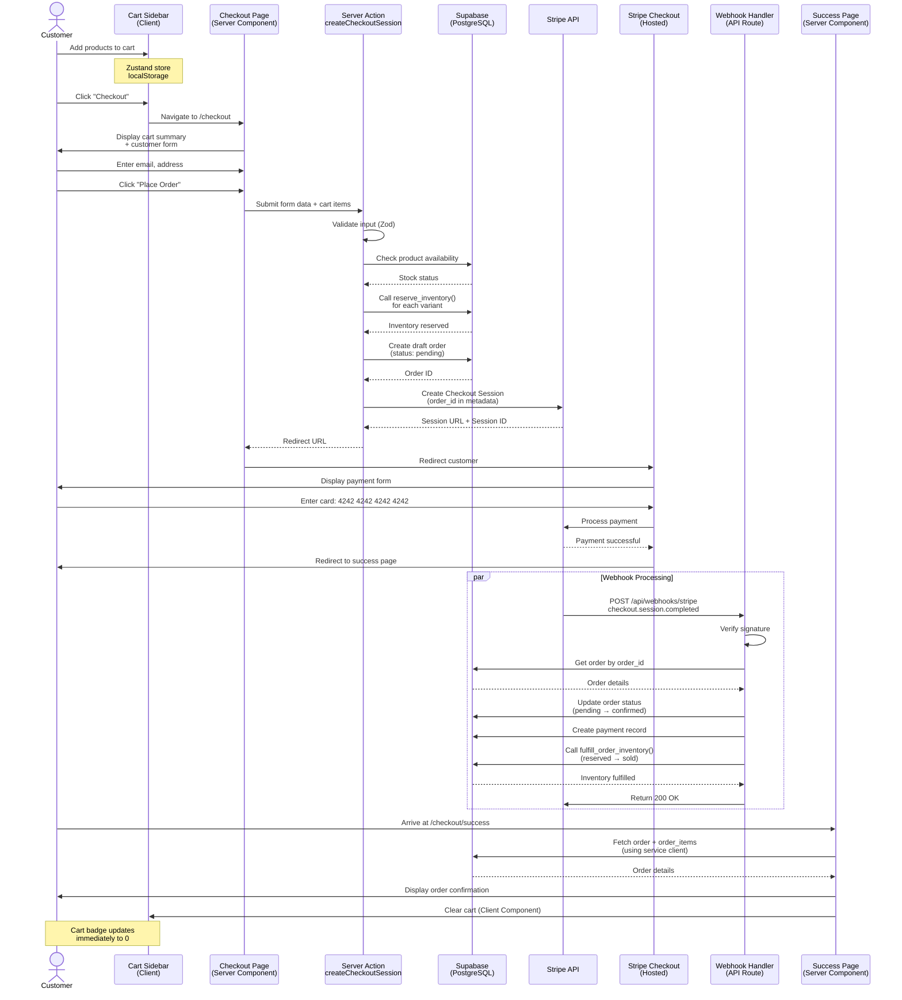
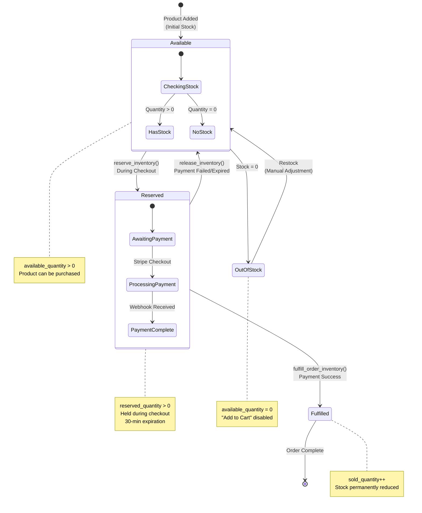
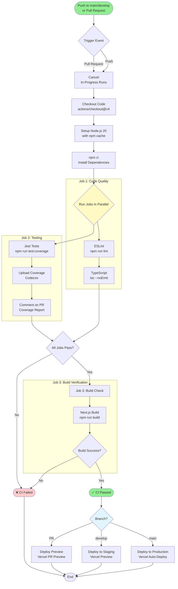

# Meriendes E-commerce - Architecture Documentation

**Version**: 1.0  
**Last Updated**: December 9, 2025  
**Status**: Active Development - Feature/Cart Branch

---

## Table of Contents

1. [System Architecture Overview](#1-system-architecture-overview)
2. [Database Entity-Relationship Diagram](#2-database-entity-relationship-diagram)
3. [Checkout Flow Sequence](#3-checkout-flow-sequence-diagram)
4. [Authentication & Authorization Flow](#4-authentication--authorization-flow)
5. [Inventory Management State Machine](#5-inventory-management-state-machine)
6. [Component Architecture](#6-component-architecture-diagram)
7. [CI/CD Pipeline Flow](#7-cicd-pipeline-flow)

---

## 1. System Architecture Overview

High-level system architecture showing main components and their interactions.



**Key Technologies:**

- **Frontend**: Next.js 16 (App Router), React 19, TypeScript, Tailwind CSS 4
- **Backend**: Supabase (PostgreSQL), Next.js Server Actions, API Routes
- **Payments**: Stripe Checkout Sessions, Webhooks
- **State**: Zustand with localStorage persistence
- **Hosting**: Vercel (Edge Functions, CDN)
- **CI/CD**: GitHub Actions

---

## 2. Database Entity-Relationship Diagram

Complete database schema showing all 22 tables and their relationships.

```mermaid
erDiagram
    customers ||--o{ customer_addresses : has
    customers ||--o{ orders : places
    customers ||--o{ carts : owns

    product_categories ||--o{ products : contains
    products ||--o{ product_variants : has
    products ||--o{ product_tags : tagged_with
    products ||--o| nutrition_info : has

    tags ||--o{ product_tags : tags

    product_variants ||--|| inventory : tracks
    product_variants ||--o{ inventory_movements : recorded_in
    product_variants ||--o{ inventory_reservations : reserved_in
    product_variants ||--o{ order_items : ordered_as
    product_variants ||--o{ cart_items : in_cart
    product_variants ||--o{ bundle_items : part_of

    bundles ||--o{ bundle_items : contains
    bundles ||--o{ order_items : ordered_as

    orders ||--o{ order_items : contains
    orders ||--o| payments : paid_by
    orders ||--o| refunds : refunded_by

    payments ||--o| refunds : refunded

    promo_codes ||--o{ orders : applies_to

    carts ||--o{ cart_items : contains

    orders ||--o{ email_notifications : triggers

    customers {
        uuid id PK
        varchar email UK
        varchar password_hash
        varchar first_name
        varchar last_name
        varchar phone
        boolean email_verified
        boolean is_active
        timestamp created_at
    }

    customer_addresses {
        uuid id PK
        uuid customer_id FK
        varchar address_label
        varchar street_address_1
        varchar city
        varchar state
        varchar zip_code
        boolean is_default
    }

    product_categories {
        uuid id PK
        varchar name UK
        varchar slug UK
        text description
        boolean is_active
    }

    products {
        uuid id PK
        uuid category_id FK
        varchar name
        varchar slug UK
        text description
        text image_url
        boolean is_active
    }

    product_variants {
        uuid id PK
        uuid product_id FK
        varchar sku UK
        varchar size
        decimal price
        varchar stripe_product_id
        varchar stripe_price_id
    }

    nutrition_info {
        uuid id PK
        uuid product_id FK
        int calories
        decimal protein_g
        decimal carbs_g
        decimal fat_g
        text allergens
    }

    tags {
        uuid id PK
        varchar name UK
        varchar tag_type
    }

    product_tags {
        uuid product_id FK
        uuid tag_id FK
    }

    inventory {
        uuid id PK
        uuid variant_id FK UK
        int available_quantity
        int reserved_quantity
        int sold_quantity
        timestamp last_updated
    }

    inventory_movements {
        uuid id PK
        uuid variant_id FK
        varchar movement_type
        int quantity
        varchar reason
        timestamp created_at
    }

    inventory_reservations {
        uuid id PK
        uuid variant_id FK
        int quantity
        uuid order_id
        timestamp expires_at
        timestamp created_at
    }

    bundles {
        uuid id PK
        varchar name
        varchar slug UK
        text description
        decimal price
        boolean is_active
    }

    bundle_items {
        uuid bundle_id FK
        uuid variant_id FK
        int quantity
    }

    promo_codes {
        uuid id PK
        varchar code UK
        varchar discount_type
        decimal discount_value
        timestamp valid_from
        timestamp valid_until
        boolean is_active
    }

    orders {
        uuid id PK
        varchar order_number UK
        uuid customer_id FK
        varchar customer_email
        decimal subtotal
        decimal tax
        decimal shipping
        decimal total
        varchar status
        timestamp created_at
    }

    order_items {
        uuid id PK
        uuid order_id FK
        uuid variant_id FK
        uuid bundle_id FK
        varchar product_name
        int quantity
        decimal unit_price
        decimal line_total
    }

    payments {
        uuid id PK
        uuid order_id FK UK
        varchar stripe_payment_intent_id UK
        varchar stripe_session_id UK
        decimal amount
        varchar currency
        varchar status
        timestamp paid_at
    }

    refunds {
        uuid id PK
        uuid payment_id FK
        decimal amount
        varchar reason
        varchar stripe_refund_id
        timestamp refunded_at
    }

    carts {
        uuid id PK
        uuid customer_id FK UK
        timestamp created_at
        timestamp updated_at
    }

    cart_items {
        uuid id PK
        uuid cart_id FK
        uuid variant_id FK
        int quantity
        timestamp added_at
    }

    email_notifications {
        uuid id PK
        uuid order_id FK
        varchar recipient_email
        varchar notification_type
        varchar status
        timestamp sent_at
    }
```

**Database Statistics:**

- **22 Tables**: Fully normalized (3NF)
- **80+ RLS Policies**: Row-Level Security on every table
- **50+ Indexes**: Optimized for query performance
- **3 PostgreSQL Functions**: Inventory operations with SECURITY DEFINER

---

## 3. Checkout Flow Sequence Diagram

End-to-end checkout and order fulfillment process.



**Key Flow Points:**

1. **Inventory Reservation**: Stock is reserved during checkout to prevent overselling
2. **Draft Order**: Order created before payment for tracking
3. **Stripe Checkout**: PCI-compliant hosted payment page
4. **Webhook Fulfillment**: Asynchronous order confirmation after payment
5. **Service Client**: Used to bypass RLS for guest orders

---

## 4. Authentication & Authorization Flow

Row-Level Security (RLS) policies and role-based access control.

```mermaid
graph TB
    subgraph "User Roles"
        Guest[Guest User<br/>Not authenticated]
        Auth[Authenticated User<br/>Has JWT token]
        Admin[Admin User<br/>@meriendes.com email]
    end

    subgraph "Supabase Client Types"
        AnonClient[Anon Client<br/>createClient]
        ServiceClient[Service Client<br/>createServiceClient]
    end

    subgraph "RLS Policies - Public Tables"
        ProductsPublic[products<br/>SELECT WHERE is_active=true]
        CategoriesPublic[product_categories<br/>SELECT WHERE is_active=true]
        TagsPublic[tags<br/>SELECT public]
        NutritionPublic[nutrition_info<br/>SELECT public]
    end

    subgraph "RLS Policies - User-Owned Tables"
        OrdersUser[orders<br/>SELECT/INSERT WHERE<br/>customer_id = auth.uid]
        CartUser[carts<br/>ALL WHERE<br/>customer_id = auth.uid]
        AddressUser[customer_addresses<br/>ALL WHERE<br/>customer_id = auth.uid]
    end

    subgraph "RLS Policies - Admin Tables"
        InventoryAdmin[inventory<br/>ALL WHERE<br/>is_admin = true]
        PaymentsAdmin[payments<br/>SELECT WHERE<br/>is_admin = true]
        AuditAdmin[audit_log<br/>ALL WHERE<br/>is_admin = true]
    end

    subgraph "RLS Policies - Guest Orders"
        GuestOrders[orders<br/>INSERT WHERE<br/>customer_id IS NULL<br/>Requires Service Client]
    end

    Guest --> AnonClient
    Auth --> AnonClient
    Admin --> AnonClient

    AnonClient --> ProductsPublic
    AnonClient --> CategoriesPublic
    AnonClient --> TagsPublic
    AnonClient --> NutritionPublic

    Auth --> OrdersUser
    Auth --> CartUser
    Auth --> AddressUser

    Admin --> InventoryAdmin
    Admin --> PaymentsAdmin
    Admin --> AuditAdmin

    ServiceClient --> GuestOrders
    ServiceClient -.->|Bypasses RLS| InventoryAdmin
    ServiceClient -.->|Bypasses RLS| PaymentsAdmin

    subgraph "Helper Functions"
        IsAdmin[is_admin<br/>Check email domain<br/>@meriendes.com]
    end

    Admin --> IsAdmin
    IsAdmin --> InventoryAdmin
    IsAdmin --> PaymentsAdmin
    IsAdmin --> AuditAdmin

    style Guest fill:#f9d5d5
    style Auth fill:#d5f9d5
    style Admin fill:#d5d5f9
    style ServiceClient fill:#ffeb99
    style GuestOrders fill:#ffe6cc
```



**Security Model:**

| Role              | Access Level                     | Implementation                                 |
| ----------------- | -------------------------------- | ---------------------------------------------- |
| **Guest**         | Public products, can checkout    | Anon key, RLS allows SELECT on active products |
| **Authenticated** | Own orders, cart, addresses      | JWT token, RLS filters by `auth.uid()`         |
| **Admin**         | All data, inventory, analytics   | Email domain check `@meriendes.com`            |
| **Service Role**  | Bypass RLS for server operations | Service key, used in webhooks/server actions   |

**RLS Policy Examples:**

```sql
-- Public product access
CREATE POLICY products_public_select ON products
  FOR SELECT
  USING (is_active = true);

-- User can view own orders
CREATE POLICY orders_user_select ON orders
  FOR SELECT
  USING (customer_id = auth.uid());

-- Admin access via helper function
CREATE POLICY products_admin_all ON products
  FOR ALL
  USING (is_admin());
```

---

## 5. Inventory Management State Machine

Inventory lifecycle from available to sold, including reservations.



**PostgreSQL Functions:**

```sql
-- Reserve inventory during checkout
CREATE FUNCTION reserve_inventory(
    p_variant_id UUID,
    p_quantity INTEGER
) RETURNS BOOLEAN;

-- Release inventory on cancellation
CREATE FUNCTION release_inventory(
    p_variant_id UUID,
    p_quantity INTEGER
) RETURNS BOOLEAN;

-- Fulfill inventory after payment
CREATE FUNCTION fulfill_order_inventory(
    p_order_id UUID
) RETURNS BOOLEAN;
```

**Inventory Table Structure:**

```sql
CREATE TABLE inventory (
    variant_id UUID PRIMARY KEY,
    available_quantity INT DEFAULT 0,  -- Can be purchased
    reserved_quantity INT DEFAULT 0,   -- Held during checkout
    sold_quantity INT DEFAULT 0        -- Permanently sold
);
```

**Concurrency Protection:**

- All functions use `SECURITY DEFINER` to bypass RLS
- Row-level locks prevent race conditions
- Transactions ensure atomicity
- Reservation expiration prevents indefinite holds

---

## 6. Component Architecture Diagram

React component hierarchy showing Server and Client Components.

```mermaid
graph TB
    subgraph "App Router - Next.js 16"
        Root[layout.tsx<br/>Root Layout<br/>Server Component]

        subgraph "Shop Routes - /(shop)"
            ShopLayout[layout.tsx<br/>Shop Layout<br/>Server]
            ProductsPage[products/page.tsx<br/>Product Listing<br/>Server]
            ProductDetail[products/[slug]/page.tsx<br/>Product Detail<br/>Server]
            CartPage[cart/page.tsx<br/>Cart Page<br/>Server]
            CheckoutPage[checkout/page.tsx<br/>Checkout Form<br/>Server]
            SuccessPage[checkout/success/page.tsx<br/>Order Confirmation<br/>Server]
        end

        subgraph "API Routes"
            StripeWebhook[api/webhooks/stripe/route.ts<br/>Webhook Handler]
        end
    end

    subgraph "Server Actions"
        CheckoutAction[checkout/actions.ts<br/>createCheckoutSession]
    end

    subgraph "Product Components"
        ProductGrid[ProductGrid.tsx<br/>Server]
        ProductCard[ProductCard.tsx<br/>Server]
        ProductDetail_Comp[ProductDetail.tsx<br/>Client]
        ProductImageGallery[ProductImageGallery.tsx<br/>Client]
        VariantSelector[VariantSelector.tsx<br/>Client]
        SearchBar[SearchBar.tsx<br/>Client]
        CategoryFilter[CategoryFilter.tsx<br/>Client]
    end

    subgraph "Cart Components - Client"
        CartButton["CartButton.tsx<br/>'use client'"]
        CartSidebar["CartSidebar.tsx<br/>'use client'"]
        CartItem["CartItem.tsx<br/>'use client'"]
        CartSummary["CartSummary.tsx<br/>'use client'"]
        EmptyCart["EmptyCart.tsx<br/>'use client'"]
    end

    subgraph "Checkout Components"
        CheckoutForm["CheckoutForm.tsx<br/>'use client'"]
        ClearCartOnSuccess["ClearCartOnSuccess.tsx<br/>'use client'"]
        PrintOrderButton["PrintOrderButton.tsx<br/>'use client'"]
    end

    subgraph "Layout Components"
        Header["Header.tsx<br/>'use client'"]
        Footer["Footer.tsx<br/>Server"]
        Navigation["Navigation.tsx<br/>'use client'"]
    end

    subgraph "UI Components - Shared"
        Button[Button.tsx]
        LoadingSpinner[LoadingSpinner.tsx]
    end

    subgraph "State Management"
        CartStore[cartStore.ts<br/>Zustand + localStorage]
    end

    subgraph "Data Layer"
        SupabaseClient[lib/supabase/client.ts<br/>Anon Key]
        SupabaseServer[lib/supabase/server.ts<br/>Service Key]
        StripeClient[lib/stripe/client.ts]
        StripeServer[lib/stripe/server.ts]
    end

    Root --> ShopLayout
    Root --> Header
    Root --> Footer

    ShopLayout --> ProductsPage
    ShopLayout --> ProductDetail
    ShopLayout --> CartPage
    ShopLayout --> CheckoutPage
    ShopLayout --> SuccessPage

    Header --> CartButton
    Header --> SearchBar
    Header --> Navigation

    ProductsPage --> ProductGrid
    ProductGrid --> ProductCard
    ProductsPage --> CategoryFilter

    ProductDetail --> ProductDetail_Comp
    ProductDetail_Comp --> ProductImageGallery
    ProductDetail_Comp --> VariantSelector

    CartButton --> CartSidebar
    CartSidebar --> CartItem
    CartSidebar --> CartSummary
    CartSidebar --> EmptyCart

    CheckoutPage --> CheckoutForm
    SuccessPage --> ClearCartOnSuccess
    SuccessPage --> PrintOrderButton

    CartButton --> CartStore
    CartSidebar --> CartStore
    ProductDetail_Comp --> CartStore
    ClearCartOnSuccess --> CartStore

    CheckoutForm --> CheckoutAction
    CheckoutAction --> SupabaseServer
    CheckoutAction --> StripeServer

    StripeWebhook --> SupabaseServer
    StripeWebhook --> StripeServer

    ProductsPage --> SupabaseServer
    ProductDetail --> SupabaseServer
    SuccessPage --> SupabaseServer

    SearchBar --> SupabaseClient
    ProductDetail_Comp --> Button
    CheckoutForm --> Button

    style Root fill:#e3f2fd
    style CartStore fill:#fff9c4
    style SupabaseServer fill:#90EE90
    style StripeServer fill:#635bff,color:#fff
    style CheckoutAction fill:#ffccbc
    style StripeWebhook fill:#ffccbc
```

**Component Patterns:**

| Type                  | Pattern                            | Examples                       |
| --------------------- | ---------------------------------- | ------------------------------ |
| **Server Components** | Data fetching, static rendering    | ProductsPage, ProductDetail    |
| **Client Components** | Interactivity, state               | CartButton, CartSidebar, Forms |
| **Server Actions**    | Mutations, secure operations       | createCheckoutSession          |
| **API Routes**        | Webhooks, third-party integrations | Stripe webhook handler         |

**State Management:**

- **Cart State**: Zustand with localStorage (client-side)
- **Server State**: React Server Components (fetch on server)
- **No global UI state**: Each component manages its own state

---

## 7. CI/CD Pipeline Flow

GitHub Actions workflow for automated testing and deployment.



**Pipeline Configuration:**

```yaml
# .github/workflows/ci.yml
name: CI

on:
  push:
    branches: [main, develop]
  pull_request:
    branches: [main, develop]

jobs:
  quality:
    - ESLint
    - TypeScript type check

  test:
    - Jest with coverage
    - Upload to Codecov
    - Comment on PR

  build:
    needs: [quality, test]
    - Next.js production build
```

**Quality Gates:**

- ✅ ESLint: No linting errors
- ✅ TypeScript: No type errors
- ✅ Tests: All 366 tests passing
- ✅ Coverage: >80% (target: 91%)
- ✅ Build: Production build succeeds

**Deployment Strategy:**

- **main**: Auto-deploy to Production (Vercel)
- **develop**: Auto-deploy to Staging (Vercel)
- **Pull Requests**: Preview deployments (Vercel)

**Performance:**

- Average pipeline duration: ~3 minutes
- Concurrency: Cancel in-progress runs on same branch
- Caching: npm dependencies cached for faster installs

---

## Architecture Decisions

### Why Next.js App Router?

- **Server Components by default**: Reduces JavaScript bundle size
- **Parallel data fetching**: Multiple queries in parallel
- **Built-in caching**: Automatic request memoization
- **SEO-friendly**: Server-side rendering for product pages

### Why Supabase?

- **PostgreSQL**: ACID compliance, referential integrity
- **RLS**: Database-level security (80+ policies)
- **Real-time**: WebSocket subscriptions (future feature)
- **Auth**: JWT tokens, OAuth providers

### Why Stripe Checkout?

- **PCI Compliance**: No card data touches our servers
- **Conversion optimized**: Stripe's hosted page converts better
- **Security**: Signature verification prevents fake orders
- **Features**: Apple Pay, Google Pay, link authentication

### Why Zustand for Cart?

- **Lightweight**: 1KB vs Redux (10KB+)
- **Simple API**: No boilerplate, no actions/reducers
- **Persistence**: Built-in localStorage middleware
- **TypeScript**: Excellent type inference

### Why Server Actions?

- **Type-safe**: Input/output validation with Zod
- **Secure**: Server-side only, no API route needed
- **Progressive enhancement**: Works without JavaScript
- **Streaming**: Can stream results back to client

---

## Performance Metrics

| Metric                             | Target | Actual | Tool            |
| ---------------------------------- | ------ | ------ | --------------- |
| **First Contentful Paint (FCP)**   | <1.5s  | ~1.2s  | Lighthouse      |
| **Time to Interactive (TTI)**      | <3.5s  | ~2.8s  | Lighthouse      |
| **Largest Contentful Paint (LCP)** | <2.5s  | ~2.1s  | Core Web Vitals |
| **Cumulative Layout Shift (CLS)**  | <0.1   | 0.05   | Core Web Vitals |
| **API Response (P95)**             | <500ms | ~320ms | Supabase        |
| **Test Coverage**                  | >80%   | 91%    | Jest            |

---

## Security Measures

1. **Row-Level Security (RLS)**
   - 80+ policies on 22 tables
   - Public, user-owned, and admin policies
   - Guest checkout via service client

2. **Authentication**
   - JWT tokens (Supabase Auth)
   - Secure password hashing (bcrypt)
   - Email verification

3. **Payment Security**
   - Stripe webhook signature verification
   - No PCI data stored
   - Service role for privileged operations

4. **Input Validation**
   - Zod schemas on client and server
   - SQL injection prevention (parameterized queries)
   - XSS protection (React escaping)

5. **Environment Security**
   - Secrets in environment variables
   - Service role key server-side only
   - CORS configured for Vercel domains

---

## Scalability Considerations

### Database

- **Indexes**: 50+ indexes for query optimization
- **Connection pooling**: Supabase Supavisor
- **Read replicas**: Available in Supabase Pro
- **Partitioning**: Consider for orders table (future)

### Application

- **Server Components**: Render on server, reduce client JS
- **Edge Functions**: Vercel Edge for API routes
- **CDN**: Static assets cached on Vercel CDN
- **Image optimization**: next/image with automatic WebP

### Monitoring

- **Error tracking**: Ready for Sentry integration
- **Performance**: Vercel Analytics
- **Database**: Supabase dashboard metrics
- **Logs**: Structured logging (JSON format)

---

## Future Enhancements

1. **Real-time Inventory**: Supabase subscriptions for stock updates
2. **User Authentication**: Full auth flow with profiles
3. **Admin Dashboard**: Product/order management
4. **Email Notifications**: Order confirmations, shipping updates
5. **Search**: Algolia or Postgres full-text search
6. **Caching**: Redis for session/cart data
7. **Subscription Bundles**: Recurring billing with Stripe

---

**Last Updated**: December 9, 2025  
**Next Review**: After user authentication implementation
